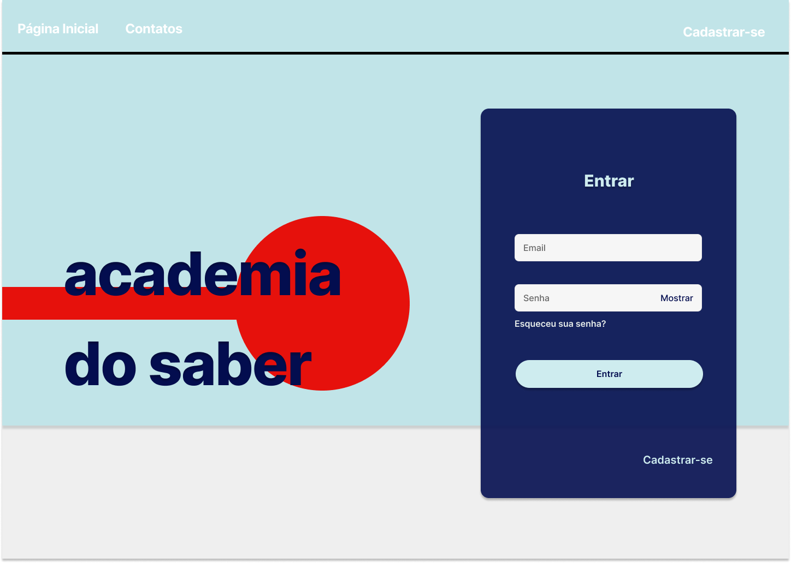
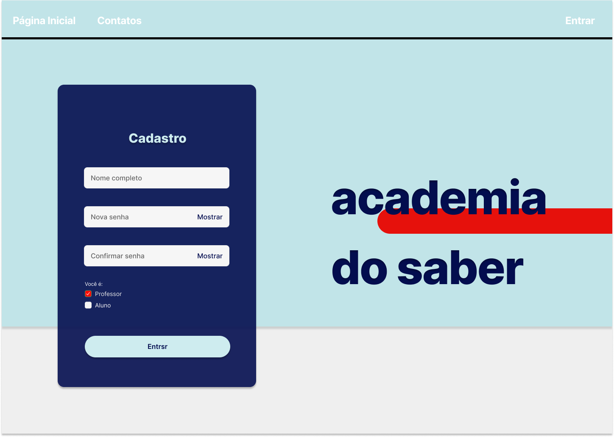
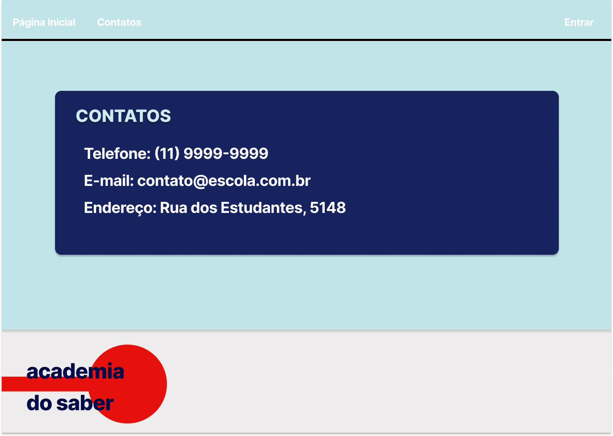

# Academia do Saber

Projeto realizado para a disciplina de Projeto Integrador do 3º período do curso de Análise de Sistemas do Senac EAD.

A plataforma da Academia do Saber visa facilitar os processos para todas as partes envolvidas acerca da instituição. 
Há um modelo de perfil para cada tipo de pessoa (aluno/pai, professor, instituição, fornecedor), onde os mesmos podem acessar as opções condizentes com a necessidade de cada. Pais e alunos têm acesso a questões relacionadas à matrícula e matérias, professores podem editar informações sobre sua disciplina, avaliar os alunos e solicitar materiais junto ao fornecedor que, por sua vez, tem acesso ao estoque e aos pedidos e, para finalizar, o acesso da instituição permite o gerenciamento das matrículas e controle do setor financeiro.

# Mapa mental 
Foi idealizado o mapa mental para direcionar as idéias para a prototipagem e tanto o nome escolhido como o logotipo foi feito em comum acordo com o grupo do projeto.

# Protótipo
O desenvolvimento das telas do protótipo deste projeto, mostradas a seguir, foram integralmente desenhadas utilizando a plataforma Figma, é possível os esboços a partir deste [link](https://www.figma.com/file/jmMecpnatRdnwJZ76bI8Bw/PI---Prot%C3%B3tipo---Grupo-01---2023.02?type=design&node-id=221-1866&mode=design&t=pMmnXqSGbuUc6rFQ-0).

## Login 

## Cadastro

## Contatos

## Fluxo da Instituíção 

### Páginal inicial 

### Gerenciamento de matrícula 

## Fluxo do Fornecedor

### Perfil do Fornecedor

### Pedidos 

### Estoque

## Fluxo do Professor 

### Perfil do Professor 

### Ementas do Professor

### Atividades do Professor

### Notas e Frequência

## Fluxo do Aluno

### Perfil do Aluno

### Matrícula do Aluno

### Lista de Matérias do Aluno 

### Consulta da Matéria

.png)

### Ementa por matéria

### Lista de Atividades

### Consulta por Atividade

### Notas e Frenquência do Aluno

# Equipe de Desenvolvimento

#### AUREA MARIA OLIVEIRA DA SILVA
#### BRUNA BARBOSA BELO
#### FILIPE ALVES DE LIMA
#### ISABELLA CAMILO FRANCO
#### VICTOR SOUZA CARDIM

